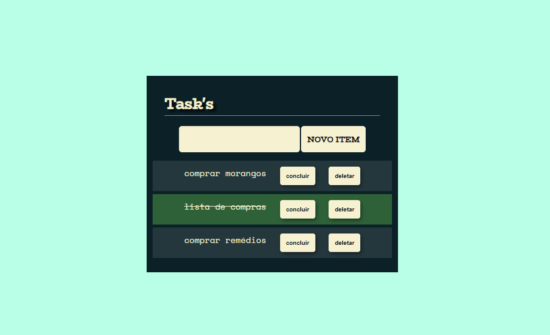

# Manipulando o DOM com JavaScript

Clique [AQUI](https://alineviana.github.io/manipulando-dom-alura/) para acessar o projeto

 

> ## 📝 Conteúdo do curso: ✨JavaScript na Web: manipule o DOM com JavaScript✨
 

- Aprenda como funciona o DOM
- Manipule o DOM para alterar, adicionar, remover e criar novos elementos na árvore de objetos
- Trabalhe com componentização para facilitar a organização do projeto
- Utilize o sistema de módulos do Javascript para proteger os arquivos

 

> ## 🖥️ Tecnologias
 

- HTML5
- CSS3
- JavaScript